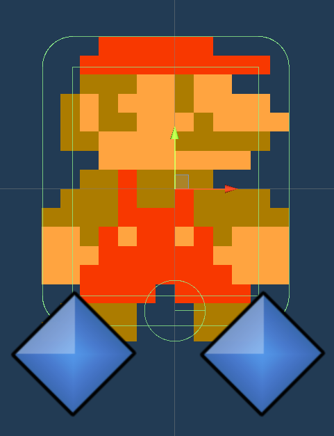
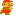
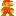
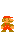

***
# Ici vous retrouverez les principales caractéristiques de Mario
## La méthode de `groundCheck` :
Pour vérifier que Mario est en contact avec le sol et pour tenter de reproduire le comportement du jeu SMB1, il faut que Mario puisse se tenir sur le bord d'un block sans tomber au sol. On utilise 2 points à ses pieds qui detecteront le contact avec tout éléments faisant parti du layer `Defaut` du jeu.  
```csharp
_grounded = Physics2D.OverlapPoint(m_GroundCheck1.position, LayerMask.GetMask("Default")) || Physics2D.OverlapPoint(m_GroundCheck2.position, LayerMask.GetMask("Default"));
```
## Les colliders de Mario 
Mario possède 2 colliders différents:
* Le premier est un `CircleCollider` utile pour que Mario ne se bloque pas sur les bords des blocs quand il court sur le sol du niveau.
* Le second est un `BoxCollider` utile pour donner une forme rectangulaire à Mario et de rentrer en collision avec les murs. Il a les angles arrondios pour ne pas se bloquer sur le bord des plateforme en hauteur, où sur le bord des tuyaux.

Chaqun de ces 2 Colliders possèdent le ``Material2D`` slippy pour glisser le long des surface, pour ne pas se bloquer sur les murs verticaux.
***


***
## Les animations
| Animation | Nom |
| :-------: | :-: |
|  | La marche |
|  | Le crouch |
|  | Le saut |

