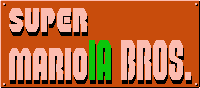

 # MarioIA

Ici vous trouverez les informations relatives au projet informatique visant au **Développement d’un environnement, sous Unity, pour entraîner une intelligence artificielle sur le jeu Super Mario Bros**.
***
# La documentation relative au projet :
## Le jeu
* [Les scripts](/Docs/Markdowns/Scripts.md)
* [La physique](/Docs/Markdowns/Physique.md)
* [Les éléments du jeu](/Docs/Markdowns/Elements.md)
* [Les 10 niveaux](/Docs/Markdowns/Levels.md)